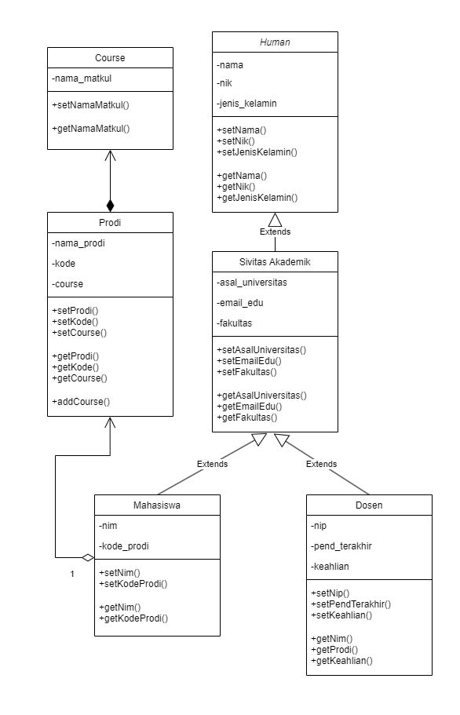
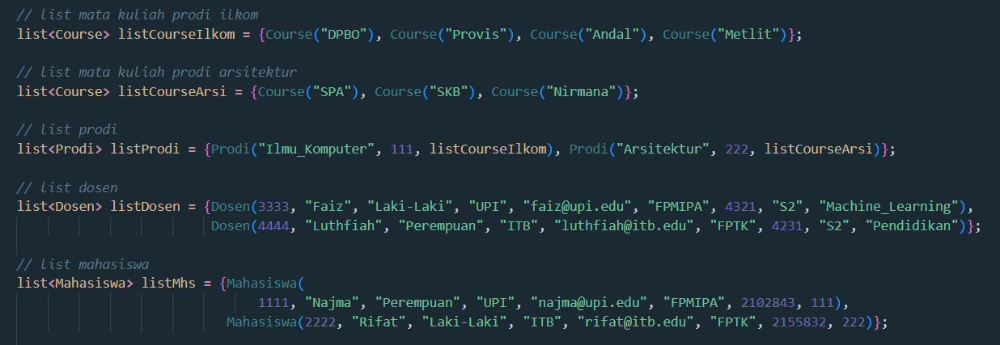
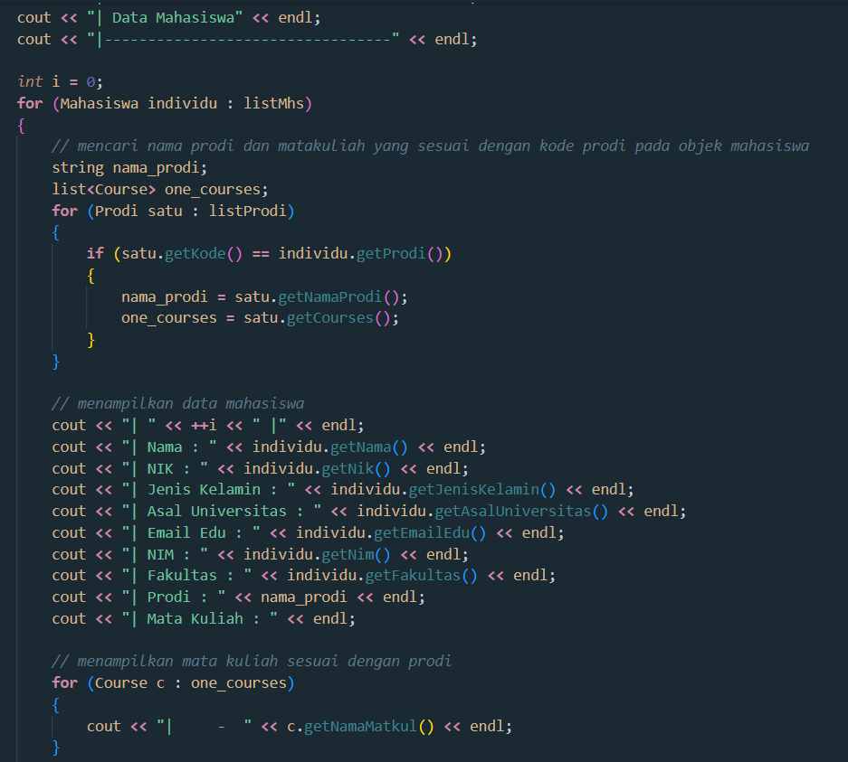
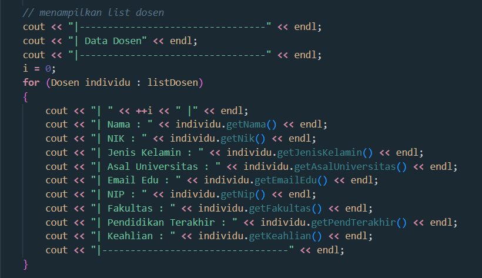
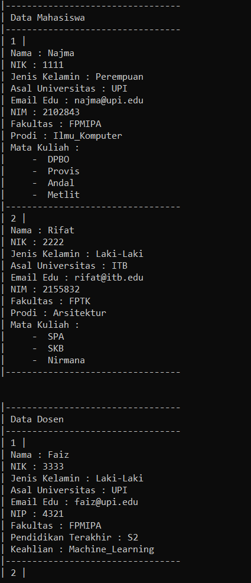
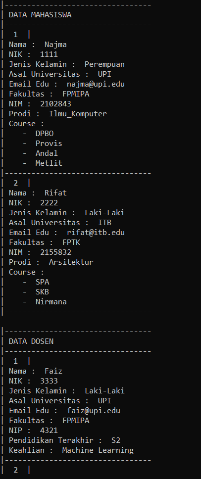

# LATIHAN4DPBO2023
Latihan 4 Praktikum Mata Kuliah Desain dan Pemrograman Berorientasi Objek. Program untuk menampilkan data mahasiswa dan dosen.

Saya Najma Qalbi Dwiharani dengan NIM 2102843 mengerjakan soal Latihan 4 dalam mata kuliah Desain dan Pemrograman Berorientasi Objek untuk keberkahanNya maka saya tidak melakukan kecurangan seperti yang telah dispesifikasikan. Aamiin.

## Desain Program

Desain kelas dalam program dapat digambarkan seperti berikut:

  

Program ini terdiri dari 6 kelas, yaitu:

### 1. Kelas Human
#### Attributes
- NIK
- Nama
- Jenis Kelamin

#### Methods
- Constructor kosong & Destructor (C++)
- Constructor dengan parameter seluruh atribut kelas
- Setter dan Getter setiap atribut

Kelas ini menjadi kelas parent dari kelas Sivitas Akademik karena merupakan objek yang sama dan kelas Sivitas Akademik membutuhkan atribut pada kelas Human.
 
### 2. Kelas Sivitas Akademik
#### Attributes
- Asal Universitas
- Email Edu
- Fakultas

#### Methods
- Constructor kosong & Destructor (C++)
- Constructor dengan parameter seluruh atribut kelas
- Setter dan Getter setiap atribut

Kelas ini menjadi child dari Human karena satu jenis objek yaitu manusia dan membutuhkan atribut dalam kelas Human. Kelas ini juga menjadi parent dari kelas Mahasiswa dan Dosen karena kedua kelas ini merupakan Human dan Sivitas Akademik sehingga kedua kelas ini juga membutuhkan atribut dalam kelas Sivitas Akademik. Terdapat atribut tambahan berupa 'fakultas' yang diambil dari kelas-kelas child dari Sivitas Akademik, karena diasumsikan bahwa kelas Sivitas Akademik dan kelas-kelas anaknya merupakan objek selalu yang memiliki fakultas (bekerja/dalam naungan fakultas tertentu).

### 3. Kelas Mahasiswa
#### Attributes
- NIM
- Prodi

#### Methods
- Constructor kosong & Destructor (C++)
- Constructor dengan parameter seluruh atribut kelas
- Setter dan Getter setiap atribut

Kelas ini menjadi child dari kelas Sivitas Akademik dan cucu dari kelas Human karena Mahasiswa merupakan Sivitas Akademik dan yang juga manusia. Atribut prodi yang ada pada kelas ini berupa kode prodi yang nantinya akan disesuaikan dengan kode prodi pada kelas Prodi. Sehingga kelas Mahasiswa meiliki hubungan agregasi dengan kelas Prodi.

### 4. Kelas Dosen
#### Attributes
- NIP
- Pendidikan Terakhir
- Keahlian

#### Methods
- Constructor kosong & Destructor (C++)
- Constructor dengan parameter seluruh atribut kelas
- Setter dan Getter setiap atribut

Kelas ini menjadi child dari kelas Sivitas Akademik dan cucu dari kelas Human karena Dosen merupakan Sivitas Akademik dan manusia. Diasumsikan bahwa dosen dapat mengajar pada prodi yang berbeda dalam satu fakultas sehingga tidak dibutuhkan atribut prodi pada kelas Dosen.

### 5. Kelas Course
#### Attributes
- Nama Matkul

#### Methods
- Constructor kosong & Destructor (C++)
- Constructor dengan parameter seluruh atribut kelas
- Setter dan Getter setiap atribut

Kelas ini merupakan kelas independen yang nantinya akan menjadi komponen dari kelas Prodi. Kelas ini tidak memiliki hubungan inheritance dengan kelas-kelas lain karena merupakan objek yang berbeda. Walaupun atribut yang tertulis pada kelas ini hanya satu, namun dapat ditambah atribut lainnya seperti semester, kelas, dan lain-lain, sehingga kelas Course ini perlu untuk menjadi kelas tersendiri.

### 6. Kelas Prodi
#### Attributes
- Nama Prodi
- Kode
- Courses

#### Methods
- Constructor kosong & Destructor (C++)
- Constructor dengan parameter seluruh atribut kelas
- Setter dan Getter setiap atribut

Kelas ini menjadi kelas independen yang memiliki hubungan agregasi dengan kelas Mahasiswa dengan kode prodinya. Atribut courses yang ada pada kelas ini merupakan list of object dari kelas Course sehingga kelas ini memiliki hubungan composite dengan kelas Course.

### Program Main

Program ini akan menampilkan informasi terkait dengan Mahasiswa dan Dosen. Informasi/atribut akan ditampilkan dalam bentuk tabel/list. Semua data pada tiap kelas diinput secara hardcode.

## Alur Program

### Input Data (Hardcode)

  

### Menampilkan Data Mahasiswa

  

Program akan menampilkan list data mahasiswa beserta atribut-atributnya, termasuk atribut dari parentnya. Pada kelas ini juga terdapat atribut prodi dimana untuk menampilkan nama prodi maka perlu dicari kode prodi yang sesuai antara kode prodi pada objek mahasiswa dan pada objek prodi. Kemudian akan ditampilkan juga semua course yang sesuai dengan prodi mahasiswa tersebut.

### Menampilkan Data Dosen

  

Program akan menampilkan list data dosen beserta atribut-atributnya, termasuk atribut dari parentnya.

## Dokumentasi

### C++

  

### Python

  
